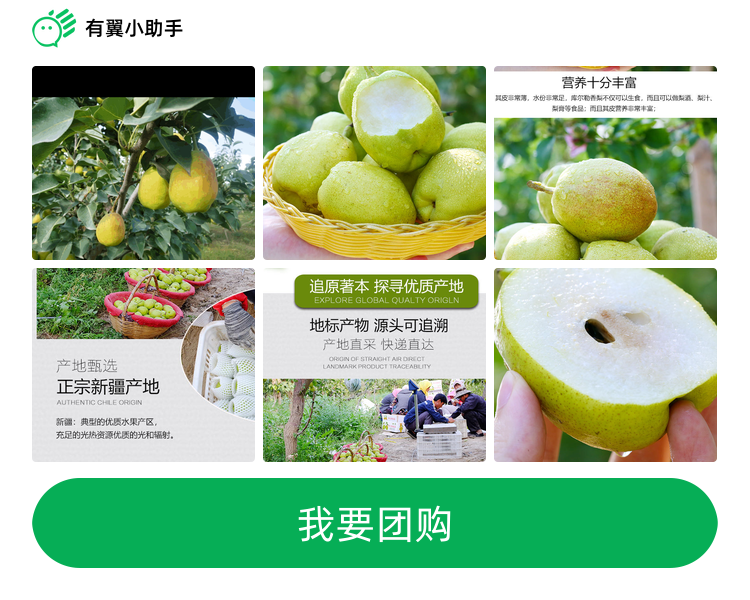

## 介绍
painter是Go语言实现的小程序生成图片库，可轻松通过 json 方式绘制一张转发到微信群或朋友圈的图片。
开发有翼小助手微信小程序时，需要生成转发到微信群的分享图和朋友圈的海报图。
起初使用的是 https://github.com/Kujiale-Mobile/Painter 前端一个很强大的工具，
但是由于微信小程序前端缓存限制以及分享触发机制的规则，导致前端逻辑复杂，不易维护，生成的分享图总是出问题，于是乎有了本项目。

## 功能
- 功能全，支持文本、图片、矩形类型的 view 绘制，扩展也比较容易。
- 支持圆角，其中图片，矩形，和整个画布支持 BorderRadius 来设置圆角
- 支持丰富的图片缩放裁剪模式，有smart、scaleToFill、aspectFit、aspectFill、top、bottom、center、left、right、top left、top right、bottom left、bottom right。除smart外，其余和微信小程序组件image的一致。
- 支持本地图片和网络图片，网络图片会启用本地缓存，不会重复下载。
- 支持文字的LineHeight、LineClamp属性，超出width自动截取
- 支持文字粗细程度属性，支持heavy、bold、bolder、normal、lighter
  
## 实体对象说明
### 调色板对象
```go
type Palette struct {
    BackgroundImage string  // 调色板背景图片
	BackgroundColor string  // 调色板背景色,比如：#fffffff
	Width int               // 调色板的宽,比如：700
	Height int              // 调色板的高,比如：600
	BorderRadius string     // 边框圆角半径,比如：8
	Views []view.View       // VIEW切片
}
```
### VIEW对象

#### VIEW接口
```go
type View interface {
	Paint(ctx *PosterContext)
}
```

#### 线VIEW
```go
type LineView struct {
	X float64              // 起点横坐标,比如：0
	Y float64              // 起点纵坐标,比如：0 
	X2 float64             // 终点横坐标,比如：100
	Y2 float64             // 终点纵坐标,比如：0
    LineWidth float64      // 线的粗细
    LineColor string       // 线的颜色，比如：#888888
}
```

#### 矩形VIEW
```go
type RectangleView struct {
	X float64              // 横坐标,比如：0
	Y float64              // 纵坐标,比如：60
	Width float64          // 矩形宽,比如：60
	Height float64         // 矩形高,比如：60
    BackgroudColor string  // 填充颜色，比如：#888888
    BorderStyle string     // 边框形式，none-无边框；solid-实线边框
    BorderRadius float64   // 边框圆角半径,比如：8,需要圆形头像时，取width的一半
    BorderWidth float64    // 边框宽
    BorderColor string     // 边框颜色，比如：#888888
}
```

#### 圆VIEW
```go
type CircleView struct {
	X float64              // 横坐标,比如：0
	Y float64              // 纵坐标,比如：60
    Radius float64         // 半径
    BackgroudColor string  // 填充颜色，比如：#888888
    BorderStyle string     // 边框形式，none-无边框；solid-实线边框
    BorderWidth float64    // 边框宽
    BorderColor string     // 边框颜色，比如：#888888
}
```

#### 图片VIEW
```go
type ImageView struct {
	X int                 // 横坐标,比如：0
	Y int                 // 纵坐标,比如：60
	Width int             // 图片宽,比如：60
	Height int            // 图片高,比如：60
	Mode string           // 缩放裁剪模式,支持：smart、scaleToFill、aspectFit、aspectFill、top、bottom、center、left、right、top left、top right、bottom left、bottom right
	URI string            // 图片URI，支持本地文件路径或网络地址。支持jpeg、png、gif、webp
	BorderRadis float64   // 边框圆角半径,比如：8,需要圆形头像时，取width的一半
}
```

图片缓存位置：./image

#### 文字VIEW
```go
type TextView struct {
	X float64              // 横坐标,比如：0
	Y float64              // 纵坐标,比如：60
	Width float64          // 文字最大宽,比如：60
	LineHeight float64     // 文字行高，小于字体高度时，自动为字体高度的1.25倍
	LineClamp string       // 行数
	Text string            // 文字，目前使用阿里普惠体，不支持表情符号
    FontFamily string      // 默认：Alibaba-PuHuiTi
	FontSize float64       // 文字大小
	FontWeight string      // 文字粗细程度，支持heavy、bold、bolder、normal、lighter
	Color string           // 文字颜色，比如：#888888
	Align string           // 文字对齐方式，支持left、center、right
}
```
字体文件位置：./assert/fonts/

字体文件命名：
- heavy -- Alibaba-PuHuiTi-Heavy.ttf
- bold -- Alibaba-PuHuiTi-Bold.ttf
- bolder -- Alibaba-PuHuiTi-Medium.ttf
- normal -- Alibaba-PuHuiTi-Regular.ttf
- lighter -- Alibaba-PuHuiTi-Light.ttf

## 使用说明

```bash
go get github.com/huagetai/painter
```

在程序执行的当前目录：创建assets和image目录
将examples中的assets/fonts复制到assets


```go
    // 构造views
    var views []view.View
    //...
    // 构造调色板
    p := palette.Palette {
		Background: "#FFFFFF",
		Width: 700,
		Height: 600,
		Views: views,
    }
    // 构造io.Writer 
    f,_ := os.Create("./assets/test.png")
    w := bufio.NewWriter(f)
    p.Paint(w)
```

examples/painter.go是一个生成微信分享图片的样例


## 使用的开源项目
- https://github.com/disintegration/imaging
- https://github.com/muesli/smartcrop
- https://github.com/nfnt/resize
- https://github.com/fogleman/gg
